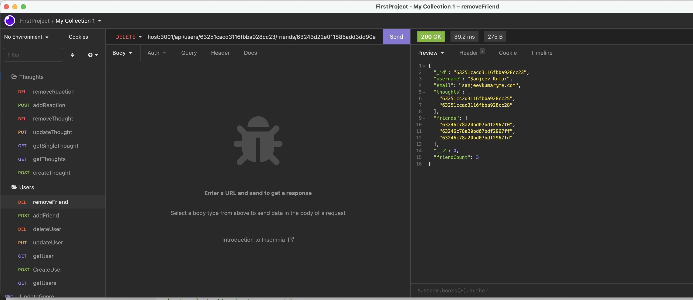

# README Generator

[Application Video URL 1  ](https://drive.google.com/file/d/1makzgewoLSzWyxKANp_zILdd2O-tWAKy/view)
[Application Video URL 1  ](https://drive.google.com/file/d/16Uq79E5plyNbDWraA9U4hXfvzIaF05o4/view)
[Repository URL ](https://github.com/SanjeevKumar-DEV/Social-Network-API)

## Description

> This is social newtwork Rest API backend 
> services provider that provides necessary 
> API to build new UI application. It has post
> delete, update and range of get functions
> on all NoSQL models. 

## Table of Contents

- [Installation](#Installation)
- [Usage](#Usage)
- [Contributing](#Contributing)
- [Tests](#Tests)
- [Questions](#Questions)
- [License](#License)

## Installation

Clone the repository using the repository URL as mentioned below.
```
Git clone git@github.com:SanjeevKumar-DEV/Social-Network-API.git
```
Open Terminal and go to cloned repository location and fire code editor
```
code .
```
Open Terminal and install the node modules.
```
npm install
```
npm run seed (Optional for DEV Mode)
```
npm run dev(DEV Mode) or npm start(PROD Mode)
```

## Usage

> Start terminal and invoke application by typing ‘npm run seed and then npm run dev(DEV Mode) OR npm start(PROD Mode)’  
 
> Using Insomnia and make Create New User Request  
 
> Using Insomnia and make Remove Friend Request  

> Using Insomnia and make Remove Reaction Request  
 


## Contributing

> Develop more Rest APIs using this repository  

## Tests

> Not Applicable 

## Questions

> Q1. What is my link to my github profile ? 
Answer: [Github Username](https://github.com/SanjeevKumar-DEV) 

> Q2. How to reach me with additional questions ? 
Answer: [Contact Email](mailto:sanjeevkumar@me.com)

## License

> License agreement is covered under EULA with Github
